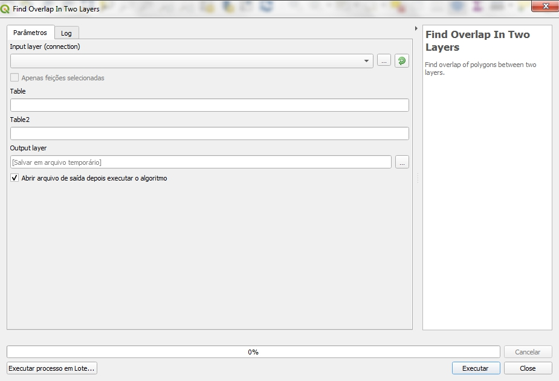

============================================
Documentation for the plugin PostGIS Queries
============================================

Installation
============

Extract the zip file available in
https://github.com/marcelgaucho/PostGISQueries/releases to the QGIS
plugins folder. This folder can be accessed as follows:

In the Menu Toolbar, Settings → User Profiles → Open Active Profile
Folder.

A folder will open. Then navigate to python/plugins.

Usage
=====

It is recommended to leave the script dialog box open after execution to
detect posible problems. First go to Settings → Options…. Then, on
Processing → General tab, check the option Keep the dialog open after
runnin an algorithm.

The usage will be shown with a script, being similar for the others. The
example will be from the Figure below, used to find overlap between two
layers.

-  Input Layer (connection): choose any layer from the layers database.

-  Table: Table name that refers to the first layer. The name must be
   accompanied by the schema. For example: bc250.water_body.

-  Table2: Table name that refers to the first layer. The name must be
   accompanied by the schema. For example: bc250.densely_builtup_area.

-  Output Layer: it is possible to leave it empty to save to a temporary
   file. If the script fails, try to save the output to a shapefile. At
   the three points beside, choose Save to File..., change the Type to
   SHP files (\*.shp), create a name for the file and press Save.

-  In some scripts, the Primary Key is also requested. The default value
   is id. We change the value if the table's primary key has a different
   name.
   

Available scripts
=================

Find Dangles
------------

Finds dangles in a line layer.

Find Empty or NULL Geometries 
-----------------------------

Finds geometries that are Empty geometries or NULL.

Find Endpoints that don’t touch polygon 
---------------------------------------

Finds the endpoints in a line layer that don’t touch the boundary of
polygon layer. A possible application is to find bridges that don’t
touch the boundary of the water body.

Find Gaps
---------

Created for a layer where its polygons must be adjacent, such as a
county, province or country boundary layer. Gaps are returned as
polygons.

Find Gaps (2) 
-------------

Has the same function as the script *Finds gaps*, however this is done
differently in the code, which can be slower or faster. The gaps are
returned as lines, and the border lines where there is no adjacent
polygon are returned, as is the case with islands and boundaries on the
sea coast.

Find Geometries Different From Other Layer
------------------------------------------

Finds geometries present in the first table (Table) that are not equal
to some geometry in the second table (Table 2).

Find Geometries With Repeated Vertices 
--------------------------------------

Finds geometries that have repeated vertices.

Find Invalid Polygons
---------------------

Finds polygons invalid according to PostGIS, which uses the OpenGIS
Simple Features Implementation Specification for SQL 1.1. Invalid
polygons are those that contain self-intersection or that have rings
overlapping. In the case of a multipolygon, the polygons that make it up
must be valid and there must also be no overlap between them, as they
must touch at most a finite number of points.

According to PostGIS, however, duplicate vertices are allowed, not
causing the polygons to be invalid.

Find K Nearest Neighbors Whithin Distance 
-----------------------------------------

Given a certain Input Layer, it detects the K nearest neighbors that are
in a neighboring layer (Neighbors Layer) and within a certain distance.
The nearest K neighbors are the K features of the neighbors layer that
are closest to a feature of the input layer and are at a certain
distance (tolerance) from that feature.

The primary key for both layers needs to be provided.

Tolerance is the limit search radius. Neighbors who are further away
than tolerance will not be included in the result. The number of
neighbors (Number of neighbors) refers to the K number of nearest
neighbors to be found.

For example, we can find the 3 rural settlements (point type) closest to
each road segment (line type), with the condition that the detected
rural settlements must be within 111 meters (0.001 degree). In this
case, the roads layer will be the Input Layer and rural settlements will
be the Neighbors Layer. The number of neighbors K will be 3 and the
tolerance will be 0.001 degree. This means that, for each road segment,
up to 3 rural settlements will be included in the result, which will be
the rural settlements closest to that segment and that are at a distance
of up to 0.001 degree.

Find Not Simple Lines (Self-Intersection)
-----------------------------------------

Finds lines that are not simple. Non-simple lines are characterized by
containing an auto-intersection. This means that the line intersects the
line itself at a point that is not one of the endpoints of the line. The
endpoints of the line are the start and end points.

It is interesting to note that a closed line, in which the end point is
equal to the start point, is a simple line, since the only place of
self-intersection of the line is the start point, which is equal to the
end point.

A multiline is considered simple if all the lines that make it up are
simple and, in addition, they do not touch each other at points that are
not at their endpoints.

Find Overlap In One Layer 
-------------------------

Used to detect the overlapping of polygons in the same layer, such as
the polygons that represent the province boundaries.

Find Overlap In Two Layers 
--------------------------

Used to find overlap between polygons of different layers. For example,
between built-up area and water body.

Find polygons that aren’t filled by polygons from other layer 
-------------------------------------------------------------

Finds parts of polygons that are not filled by polygons from another
layer. The Outer Polygon Table is the layer whose polygons must be
filled with polygons present in the Inner Polygon Table.

Parts of the external polygons that are not filled by inner polygons are
returned, as well as the respective primary key of the external polygon.
The name of the primary key field of the Outer Polygon Table, the Outer
Polygon Table Primary Key, must also be passed as parameter.

Find Polygons that don’t contain 1 point (Acha polígonos que não contêm 1 ponto)
--------------------------------------------------------------------------------

Finds polygons that do not contain 1 point belonging to another layer,
of points. That is, the polygons that do not contain any points or
contain more than one point.

Find Polygons with Holes 
------------------------

Finds polygons that contain holes. It can be useful to detect polygons
with holes in boundary layers (provinces, counties, etc.), where there
may be holes, but it is uncommon to have them.

Find Pseudonodes
----------------

Finds the pseudonodes of a line layer. This means finding where there is
a break in geometry, but there is no intersection of lines.

Tolerance is used to signal that two ends of different lines will be
considered as a node if they are distant less than the tolerance. The
default tolerance is 0.000001, which is 11 cm in Equator Line. The
intention of using tolerance is to achieve pseudonode detection even
where the edges are not perfectly adherent in PostGIS.

Although the extremes whose distance is less than the tolerance are
considered as a single node in the analysis, two points related to the
extremes will be returned in the result if they do not have the same
coordinates and are pseudonodes.

The excluded field is used to signal that adjacent lines with distinct
attributes in this field will not be considered as pseudonodes.

Find Repeated Geometries
------------------------

Finds duplicated geometries in a layer.

Find Undershoot and Overshoot
-----------------------------

Used to find undershoot and overshoot in a layer of lines. Tolerance is
the maximum distance for detection. For example, if the distance from a
dangle to another line is greater than the tolerance, it will not be
included in the result. The tolerance unit depends on the coordinate
system, with the standard tolerance set at 0.0001, approximately 11
meters in the WGS 84 2000 longitude and latitude coordinate system.

Return Geometry Without Holes
-----------------------------

Return the geometries of a layer without their interior rings, also
known as holes.
