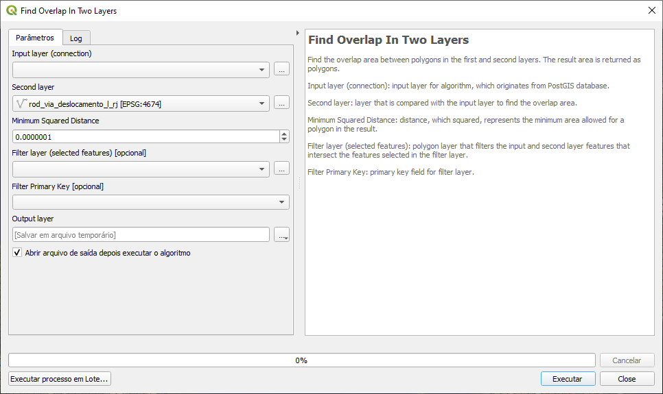

============================================
Documentation for the plugin PostGIS Queries
============================================

Installation
============

Extract the zip file available in
https://github.com/marcelgaucho/PostGISQueries/releases to the QGIS
plugins folder. This folder can be accessed as follows:

In the Menu Toolbar, Settings → User Profiles → Open Active Profile
Folder.

A folder will open. Then navigate to python/plugins.

It is also possible to install from the QGIS Plugin Manager.

Plugin Behaviour
================

Each layer passed to the plugin represents a table or a view in the
database. This table is passed, along with other parameters of the
script, to perform the SQL query through the script gdal:executesql,
which returns the result in a spatial layer.

Usage 
======

It is recommended to leave the script dialog box open after execution to
find out about possible problems. First go to Settings → Options… .
Then, in the Processing → General tab, check the option Keep the dialog
open after running an algorithm.

In case the script uses more than one layer, the layers must be in the
same Coordinate Reference System (CRS).

The usage will be illustrated with a script, and the information given
also applies to the other scripts. The example will be from the Figure 1,
used to find overlap between two layers.

- Input Layer (connection): first input layer for the script. It is also
  used to identify the database that will perform the query.
- Second layer: second layer passed to the script. There are cases where
  more than one layer needs to be passed, as is the case in the example,
  which detects the overlap between two layers.
- Minimum Squared Distance: parameter passed to the query, which is in
  the unit (degree or meter) of the input layer’s CRS.
- Filter layer (selected features) [optional]: layer of polygon type
  used as a filter for the input layers. It works by selecting, in the
  input layer, only those features that intersect the features selected
  in the current layer. Note that you need to select features in this
  layer for the script to work, otherwise it returns an error.
  Furthermore, the use of this layer is optional, so it is possible to
  leave it empty in order that no filter is applied.
- Filter Primary Key [optional]: primary key field of the filter layer
  which, therefore, has a unique value for each feature. The default
  value is “id”, so it will be automatically selected if the layer
  contains this field. The field is marked as optional, but if the
  filter layer is selected, selecting the primary key field becomes
  mandatory. This field will be used in the query together with its
  selected values and, therefore, if it does not contain unique values,
  the results will not be as intended.
- Output Layer: output layer. Often, it is possible to leave it empty to
  save to a temporary file, but is also possible to save the result to a
  specific file to be stored. If the script fails to save the result,
  try to resolve it by saving the output in a shapefile (\*.shp) or
  geopackage (\*.gpkg). In the three dots next to it, choose *Save in
  file…*, change the *Type* to SHP or GPKG files (\*.shp or \*.gpkg),
  create a name for the file and press to save.

In some scripts, the Input Primary Key is also requested, which is the
primary key of the input layer, with information similar to the Filter
Primary Key.

   Figure 1: Script to find the overlap between two layers

Available scripts
=================

Find Dangles
------------

Finds dangles for a line layer. Dangles are line nodes not connected to
another line.

Input layer (connection): input line layer for algorithm, which
originates from PostGIS database.

Input Primary Key: primary key field for input layer.

Node Join Tolerance: distance of a node to another line that considers
the node connected to it.

Filter layer (selected features): polygon layer that filters the input
features that intersect the features selected in the filter layer.

Filter Primary Key: primary key field for filter layer.

Find Empty or NULL Geometries 
------------------------------

Find layer geometries that are Empty geometries or NULL.

Input layer (connection): input layer for algorithm, which originates
from PostGIS database.

Input Primary Key: primary key field for input layer.

Find Endpoints that don’t touch polygon 
----------------------------------------

Find endpoints of a line that don't touch a polygon boundary. A possible
application of the script is to find bridges that don’t touch the
boundary of a water body.

Input layer (connection): input line layer for algorithm, which
originates from PostGIS database.

Polygon layer: polygon layer that relates to the input layer.

Node Join Tolerance: distance of a node or endpoint to a polygon
boundary that considers the node intersects this boundary.

Filter layer (selected features): polygon layer that filters the input
and polygon features that intersect the features selected in the filter
layer.

Filter Primary Key: primary key field for filter layer.

Find Gaps
---------

For a polygon layer that should have adjacent features, the gaps between
polygons are returned as polygons.

This algorithm has the option of selecting features in the input layer,
for the sake of operation ease. Sometimes we would like to find the gap
between just two adjacent features, rather than using the entire layer,
so this options serves that purpose. In addition to this option,
filtering by selected features in a filter layer of polygon type
continues to be valid, as in the other algorithms.

Input layer (connection) (use selection if exists): input polygon layer
for algorithm, which originates from PostGIS database. If features are
selected in this layer, the algorithm is applied only to these features.

Input Primary Key: primary key field for input layer. If there are
features selected in the input layer, the input primary key must be
selected.

Minimum Squared Distance: distance, which squared, represents the
minimum area allowed for a polygon in the result. For example, taking
the default value of the field, which is 0.0000001. Assuming that the
layer CRS is in degrees, this value is equivalent to approximately 11 mm
at the Equator, and therefore the minimum area of a polygon in the
result is near to 11 mm\ :sup:`2`.

Filter layer (selected features): polygon layer that filters the input
features that intersect the features selected in the filter layer.

Filter Primary Key: primary key field for filter layer.

Find Geometries Different From Other Layer
------------------------------------------

Find geometries of input layer that are different from geometries in the
second layer.

Input layer (connection): input layer for algorithm, which originates
from PostGIS database.

Second layer: layer that is compared with the input layer.

Input Primary Key: primary key field for input layer.

Filter layer (selected features): polygon layer that filters the input
and second layer features that intersect the features selected in the
filter layer.

Filter Primary Key: primary key field for filter layer.

Find Geometries With Repeated Vertices 
---------------------------------------

Find geometries that have duplicated vertices.

Input layer (connection): input layer for algorithm, which originates
from PostGIS database.

Filter layer (selected features): polygon layer that filters the input
features that intersect the features selected in the filter layer.

Filter Primary Key: primary key field for filter layer.

Find Invalid Polygons
---------------------

Find invalid polygons for a polygon layer, according to Open Geospatial
Consortium (OGC) rules, described by OGC Simple Features Implementation
Specification for SQL 1.1. Briefly, invalid polygons are those that
contain self-intersection or that have overlapping rings. Rings must be
contained in the exterior ring and may touch each other, but only as
tangents. The polygon interior must not be splitted, by rings, in more
than one part. For a multipolygon, there are similar rules: the
respective polygons must be valid, there must not be overlap and they
may touch, but only as tangents. For more detail, refer to PostGIS
documentation in

https://postgis.net/docs/using_postgis_dbmanagement.html#OGC_Validity .

Input layer (connection): input polygon layer for algorithm, which
originates from PostGIS database.

Filter layer (selected features): polygon layer that filters the input
features that intersect the features selected in the filter layer.

Filter Primary Key: primary key field for filter layer.

Find K Nearest Neighbors Within Distance
----------------------------------------

Find the K Nearest Neighbors within certain distance of the features. It
takes 2 layers. The first is the input layer and the second is the
neighbors layer. The features returned are from the neighbors layer. For
each feature of the input layer, the K nearest features from the
neighbors layer that are within the threshold distance are returned.

Input layer (connection): input layer for algorithm, which originates
from PostGIS database.

Input Primary Key: primary key field for input layer.

Second layer: neighbors layer, from which features are returned.

Second Layer Primary Key: primary key field for second layer.

Threshold Distance: limit distance from the input layer at which
features from the second layer are returned. Neighbors that do not
intersect the search radius designated by the threshold distance will
not be returned.

Number of neighbors: maximum number of neighbors, for each feature and
located within the threshold distance, that can be returned.

Filter layer (selected features): polygon layer that filters the input
and second layer features that intersect the features selected in the
filter layer.

Filter Primary Key: primary key field for filter layer.

Find Not Simple Lines (Self-Intersection)
-----------------------------------------

Find lines that are not simple. A not simple line is a line that has a
self-intersection. A not simple multiline is a multiline in which at
least one of the lines that form it is not simple or in which the lines
that form it touch at points other than its boundaries.

Input layer (connection): input line layer for algorithm, which
originates from PostGIS database.

Filter layer (selected features): polygon layer that filters the input
features that intersect the features selected in the filter layer.

Filter Primary Key: primary key field for filter layer.

Find Overlap In One Layer 
--------------------------

Find the overlap area of distinct polygons in a layer. The result area
is returned as polygons.

Input layer (connection) (use selection if exists): input polygon layer
for algorithm, which originates from PostGIS database. If features are
selected in this layer, the algorithm is applied only to these features.

Input Primary Key: primary key field for input layer. If there are
features selected in the input layer, the input primary key must be
selected.

Minimum Squared Distance: distance, which squared, represents the
minimum area allowed for a polygon in the result. For example, taking
the default value of the field, which is 0.0000001. Assuming that the
layer CRS is in degrees, this value is equivalent to approximately 11 mm
at the Equator, and therefore the minimum area of a polygon in the
result is near to 11 mm\ :sup:`2`.

Filter layer (selected features): polygon layer that filters the input
features that intersect the features selected in the filter layer.

Filter Primary Key: primary key field for filter layer.

Find Overlap In Two Layers 
---------------------------

Find the overlap area between polygons in the first and second layers.
The result area is returned as polygons.

Input layer (connection): input polygon layer for algorithm, which
originates from PostGIS database.

Second layer: layer that is compared with the input layer to find the
overlap area.

Minimum Squared Distance: distance, which squared, represents the
minimum area allowed for a polygon in the result. For example, taking
the default value of the field, which is 0.0000001. Assuming that the
layer CRS is in degrees, this value is equivalent to approximately 11 mm
at the Equator, and therefore the minimum area of a polygon in the
result is near to 11 mm\ :sup:`2`.

Filter layer (selected features): polygon layer that filters the input
and second layer features that intersect the features selected in the
filter layer.

Filter Primary Key: primary key field for filter layer.

Find polygons that aren’t filled by polygons from other layer 
--------------------------------------------------------------

Find parts of polygons of an outer polygon layer that aren't filled by
polygons from an inner polygon layer.

Input layer (connection) (Outer Polygon): input polygon layer for
algorithm, which originates from PostGIS database, and consists of an
external polygon layer.

Input Primary Key: primary key field for input layer.

Inner Polygon: polygon layer that is compared with the input layer and
that should fill it.

Minimum Squared Distance: distance, which squared, represents the
minimum area allowed for a polygon in the result. For example, taking
the default value of the field, which is 0.0000001. Assuming that the
layer CRS is in degrees, this value is equivalent to approximately 11 mm
at the Equator, and therefore the minimum area of a polygon in the
result is near to 11 mm\ :sup:`2`.

Filter layer (selected features): polygon layer that filters the input
and inner polygon layer features that intersect the features selected in
the filter layer.

Filter Primary Key: primary key field for filter layer.

Find Polygons that don’t contain 1 point
----------------------------------------

Find polygons that don't contain 1 point. That is, they contain more
than one point or no point.

Input layer (connection): input polygon layer for algorithm, which
originates from PostGIS database.

Point layer: point layer that is compared with the input layer.

Filter layer (selected features): polygon layer that filters the input
features that intersect the features selected in the filter layer.

Filter Primary Key: primary key field for filter layer.

Find Polygons with Holes 
-------------------------

Find polygons that contain holes.

Input layer (connection): input polygon layer for algorithm, which
originates from PostGIS database.

Filter layer (selected features): polygon layer that filters the input
features that intersect the features selected in the filter layer.

Filter Primary Key: primary key field for filter layer.

Find Pseudonodes
----------------

Find pseudonodes for a line layer. Pseudonodes are nodes that form a
break in the geometry, but without intersecting lines.

Input layer (connection): input line layer for algorithm, which
originates from PostGIS database.

Input Primary Key: primary key field for input layer.

Excluded Field(s): if fields are selected, adjacent features with a
change in these fields don't generate pseudonodes.

Node Join Tolerance: distance of a node to another line that considers
the node connected to it.

Filter layer (selected features): polygon layer that filters the input
features that intersect the features selected in the filter layer.

Filter Primary Key: primary key field for filter layer.

Find Repeated Geometries
------------------------

Find duplicated geometries in a layer.

Input layer (connection): input layer for algorithm, which originates
from PostGIS database.

Input Primary Key: primary key field for input layer.

Filter layer (selected features): polygon layer that filters the input
features that intersect the features selected in the filter layer.

Filter Primary Key: primary key field for filter layer.

Find Undershoot and Overshoot
-----------------------------

Find undershoot and overshoot for a line layer. Undershoot and overshoot
are dangles that don't snap to another line: they go beyond or fall
short of the connection.

Input layer (connection): input line layer for algorithm, which
originates from PostGIS database.

Node Join Tolerance: distance of a node to another line that considers
the node connected to it.

Threshold Distance: maximum distance to another line for the dangle to
be returned in the result. A large value may include unexpected dangles
in the results. Assuming that the layer CRS is in degrees, this value is
equivalent to approximately 55 m at the Equator, and therefore dangles
that are up to nearly 55 m from a line will be included in the result.

Filter layer (selected features): polygon layer that filters the input
features that intersect the features selected in the filter layer.

Filter Primary Key: primary key field for filter layer.

Return Geometry Without Holes
-----------------------------

Return geometry of a polygon layer without any holes.

Input layer (connection): input polygon layer for algorithm, which
originates from PostGIS database.

Input Primary Key: primary key field for input layer.

Filter layer (selected features): polygon layer that filters the input
features that intersect the features selected in the filter layer.

Filter Primary Key: primary key field for filter layer.
