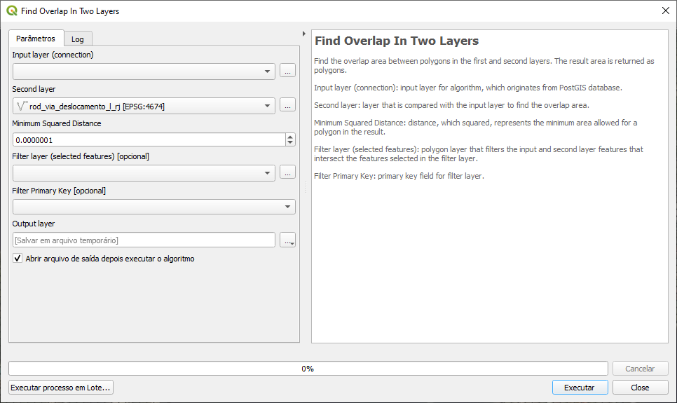

======================================
Documentação do plugin PostGIS Queries
======================================

Instalação
==========

Extraia o arquivo zip disponível em
https://github.com/marcelgaucho/PostGISQueries/releases para a pasta de
plugins do QGIS. Essa pasta pode ser acessada da seguinte maneira:

Menu Configurações → Perfis de Usuário → Abrir Pasta de Perfil Ativo

Uma pasta será aberta. Nela navegue até python/plugins.

Também é possível instalar a partir do Gerenciador de Plugins do QGIS.

Funcionamento do Plugin
=======================

Cada camada passada para o plugin representa uma tabela ou view no banco
de dados. Essa tabela é passada, junto com outros parâmetros do script,
para a realização da consulta SQL através do script gdal:executesql, que
retorna o resultado em uma camada espacial.

Uso
===

Recomenda-se deixar a caixa do script aberta após a execução para, em
caso de possíveis problemas, saber a origem da falha. Primeiro vá em
Configurações → Opções… . Depois, na aba Processamento → Geral, marque a
opção *Manter a caixa de diálogo aberto após executar o algoritmo*.

Caso o script utilize mais de uma camada, as camadas devem estar no
mesmo Sistema de Referência de Coordenadas (SRC).

O uso será ilustrado com um script, e as informações passadas também se
aplicam para os demais scripts. O exemplo será do Script da Figura 1,
usado para achar sobreposição entre duas camadas.

- Input layer (connection): primeira camada de entrada para o script.
  Ela também é usada para identificar o banco de dados que vai realizar
  a consulta.
- Second layer: segunda camada passada para o script. Existem casos em
  que mais de uma camada precisa ser passada, como é o caso do exemplo,
  que detecta a sobreposição entre duas camadas.
- Minimum Squared Distance: parâmetro passado para a consulta, que está
  na unidade (grau ou metro) do SRC da camada de entrada.
- Filter layer (selected features) [optional]: camada do tipo polígono
  usada como filtro para as camadas de entrada. Funciona selecionando,
  na camada de entrada, apenas aquelas feições que intercectam as
  feições selecionadas na presente camada. Note que é preciso selecionar
  feições nesta camada para que o script funcione, caso contrário ele
  retorna um erro. Ainda, o uso desta camada é opcional, portanto é
  possível deixá-la vazia para que nenhum filtro seja aplicado.
- Filter Primary Key [optional]: campo de chave primária da camada de
  filtro que, portanto, tem um valor único para cada feição. O valor
  padrão é "id", portanto este será selecionado automaticamente caso a
  camada contenha esse campo. O campo está marcado como opcional, mas
  caso a camada de filtro seja selecionada, selecionar o campo de chave
  primária passa a ser obrigatório. Este campo será usado na consulta
  junto com seus valores selecionados e, portanto, caso não contenha
  valores únicos, os resultados não serão os pretendidos.
- Output Layer: camada de saída. Frequentemente, é possível deixar vazio
  para salvar em um arquivo temporário, mas é possível também salvar o
  resultado em um arquivo específico para ser armazenado. Caso o script
  dê alguma falha para salvar o resultado, tente resolver salvando a
  saída em um shapefile ou geopackage (\*.gpkg). Nos três pontos ao
  lado, escolha *Salvar no arquivo…*, altere o *Tipo* para SHP ou GPKG
  arquivos (\*.shp ou \*gpkg), crie um nome para o arquivo e pressione
  para salvar.

Em alguns scripts, é pedido também a Input Primary Key, que é a chave
primária da camada de entrada, com informações análogas ao Filter
Primary Key.

   Figura 1: Script para achar sobreposição entre duas camadas

Scripts disponíveis
===================

Find Dangles
------------

Acha dangles (pontas soltas) em uma camada de linhas. Dangles são nós de
uma camada de linhas que não estão conectados a uma outra linha.

Input layer (connection): camada de linha de entrada para o algoritmo,
que é originada de um banco de dados PostGIS.

Input Primary Key: campo de chave primária para a camada de entrada.

Node Join Tolerance: distância de um nó para outra linha que considera o
nó como conectado a essa linha.

Filter layer (selected features): camada de filtro, tipo polígono, que
filtra as feições da camada de entrada que intersectam as feições
selecionadas na camada de filtro.

Filter Primary Key: campo de chave primária da camada de filtro.

Find Empty or NULL Geometries 
------------------------------

Acha geometrias vazias ou que estão preenchidas com NULL.

Este algoritmo não apresenta a opção de filtragem por uma camada, pois
não há como aplicar um filtro espacial sobre feições sem uma geometria
válida ou com NULL.

Input layer (connection): camada de entrada para o algoritmo, que é
originada de um banco de dados PostGIS.

Input Primary Key: campo de chave primária para a camada de entrada.

Find Endpoints that don’t touch polygon
---------------------------------------

Acha os extremos de linha que não tocam uma fronteira de polígono. Uma
aplicação possível é achar pontes que não tocam a fronteira de uma massa
d’água.

Input layer (connection): camada de entrada, tipo linha, para o
algoritmo, que é originada de um banco de dados PostGIS.

Polygon layer: camada tipo polígono que se relaciona com a camada de
entrada.

Node Join Tolerance: distância de um nó para a fronteira de um polígono
que considera que o nó intersecta essa fronteira.

Filter layer (selected features): camada de filtro, tipo polígono, que
filtra as feições da camada de entrada que intersectam as feições
selecionadas na camada de filtro.

Filter Primary Key: campo de chave primária da camada de filtro.

Find Gaps
---------

Para uma camada tipo polígono que deve ter feições adjacentes, as
lacunas entre os polígonos são retornadas como feições tipo polígono.

Este algoritmo possui a opção de seleção de feições na camada de
entrada, por uma questão de facilidade operacional. Por vezes
gostaríamos de achar a lacuna entre apenas duas feições adjacentes, em
vez de usar a camada inteira, então essa opção serve a esse propósito.
Além dessa opção, a filtragem pelas feições selecionadas em uma camada
de filtro do tipo polígono continua sendo válida, como nos outros
algoritmos.

Input layer (connection) (use selection if exists): camada de entrada,
tipo polígono, para o algoritmo, que é originada de um banco de dados
PostGIS. Caso existam feições selecionadas, o algoritmo será aplicado
apenas para essas feições.

Input Primary Key: campo de chave primária para a camada de entrada.
Caso haja feições selecionadas na camada de entrada, este campo precisa
ser selecionado.

Minimum Squared Distance: distância que, elevada ao quadrado, representa
a área mínima permitida para um polígono no resultado. Por exemplo,
tomando o valor padrão do campo, que é 0,0000001. Supondo que o SRC da
camada esteja em graus, esse valor equivale a aproximadamente 11 mm no
Equador, e portanto a área mínima de um polígono no resultado é cerca de
11 mm\ :sup:`2`.

Filter layer (selected features): camada de filtro, tipo polígono, que
filtra as feições da camada de entrada que intersectam as feições
selecionadas na camada de filtro.

Filter Primary Key: campo de chave primária da camada de filtro.

Find Geometries Different From Other Layer
------------------------------------------

Acha geometrias presentes na camada de entrada que são diferentes das
geometrias presentes na segunda camada.

Input layer (connection): camada de entrada para o algoritmo, que é
originada de um banco de dados PostGIS.

Second layer: camada que é comparada com a camada de entrada.

Input Primary Key: campo de chave primária para a camada de entrada.

Filter layer (selected features): camada de filtro, tipo polígono, que
filtra as feições da camada de entrada que intersectam as feições
selecionadas na camada de filtro.

Filter Primary Key: campo de chave primária da camada de filtro.

Find Geometries With Repeated Vertices
--------------------------------------

Acha geometrias que possuem vértices duplicados.

Input layer (connection): camada de entrada para o algoritmo, que é
originada de um banco de dados PostGIS.

Filter layer (selected features): camada de filtro, tipo polígono, que
filtra as feições da camada de entrada que intersectam as feições
selecionadas na camada de filtro.

Filter Primary Key: campo de chave primária da camada de filtro.

Find Invalid Polygons
---------------------

Acha polígonos inválidos segundo as regras da Open Geospatial Consortium
(OGC), descritas pela OGC Simple Features Implementation Specification
for SQL 1.1. Resumidamente, polígonos inválidos são aqueles que contêm
autointerseção ou que possuem anéis sobrepostos. Anéis devem estar
contidos no anel exterior e podem se tocar, mas apenas como tangentes. O
interior do polígono não deve ser subdividido por anéis em mais de uma
parte. Para multipolígonos, as regras são similares: os respectivos
polígonos precisam ser válidos e não deve haver sobreposição entre eles,
sendo que somente podem se tocar como tangentes. Para mais detalhes,
consultar a documentação do PostGIS:
https://postgis.net/docs/using_postgis_dbmanagement.html#OGC_Validity .

Input layer (connection): camada de entrada, tipo polígono, para o
algoritmo, que é originada de um banco de dados PostGIS.

Filter layer (selected features): camada de filtro, tipo polígono, que
filtra as feições da camada de entrada que intersectam as feições
selecionadas na camada de filtro.

Filter Primary Key: campo de chave primária da camada de filtro.

Find K Nearest Neighbors Within Distance
----------------------------------------

Acha os K Vizinhos mais Próximos dentro de uma certa distância das
feições. O algoritmo precisa de 2 camadas. A primeira é a camada de
entrada e a segunda é a camada dos vizinhos. As feições retornadas
pertencem à camada de vizinhos. Para cada feição da camada de entrada,
as K feições mais próximas pertencentes à camada de vizinhos são
retornadas, desde que estejam dentro da distância limite.

Input layer (connection): camada de entrada para o algoritmo, que é
originada de um banco de dados PostGIS.

Input Primary Key: campo de chave primária para a camada de entrada.

Second layer: camada de vizinhos, da qual as feições são retornadas.

Second Layer Primary Key: campo de chave primária para a segunda camada.

Threshold Distance: distância limite a partir da camada de entrada em
que as feições da segunda camada são retornadas. Vizinhos que não
intersectam o raio de busca designado pela distância limite não são
retornados.

Number of neighbors: número máximo de vizinhos, para cada feição e
localizados dentro da distância limite, que podem ser retornados.

Filter layer (selected features): camada de filtro, tipo polígono, que
filtra as feições da camada de entrada que intersectam as feições
selecionadas na camada de filtro.

Filter Primary Key: campo de chave primária da camada de filtro.

Find Not Simple Lines (Self-Intersection)
-----------------------------------------

Acha linhas que não são simples. Uma linha não simples é uma linha que
contém uma auto-interseção. Uma multilinha não simples é uma multilinha
em que ao menos uma das linhas que a compõem é não simples, ou em que as
linhas que a formam se tocam em pontos que não sejam suas fronteiras.

Input layer (connection): camada de entrada, tipo linha, para o
algoritmo, que é originada de um banco de dados PostGIS.

Filter layer (selected features): camada de filtro, tipo polígono, que
filtra as feições da camada de entrada que intersectam as feições
selecionadas na camada de filtro.

Filter Primary Key: campo de chave primária da camada de filtro.

Find Overlap In One Layer
-------------------------

Acha a área de sobreposição entre os distintos polígonos em uma mesma
camada. A área resultante é retornada como polígonos.

Input layer (connection) (use selection if exists): camada de entrada,
tipo polígono, para o algoritmo, que é originada de um banco de dados
PostGIS. Caso existam feições selecionadas, o algoritmo será aplicado
apenas para essas feições.

Input Primary Key: campo de chave primária para a camada de entrada.
Caso haja feições selecionadas na camada de entrada, este campo precisa
ser selecionado.

Minimum Squared Distance: distância que, elevada ao quadrado, representa
a área mínima permitida para um polígono no resultado. Por exemplo,
tomando o valor padrão do campo, que é 0,0000001. Supondo que o SRC da
camada esteja em graus, esse valor equivale a aproximadamente 11 mm no
Equador, e portanto a área mínima de um polígono no resultado é cerca de
11 mm\ :sup:`2`.

Filter layer (selected features): camada de filtro, tipo polígono, que
filtra as feições da camada de entrada que intersectam as feições
selecionadas na camada de filtro.

Filter Primary Key: campo de chave primária da camada de filtro.

Find Overlap In Two Layers 
---------------------------

Acha a área de sobreposição entre polígonos da primeira e segunda
camadas. A área resultante é retornada como polígonos.

Input layer (connection): camada de entrada, tipo polígono, para o
algoritmo, que é originada de um banco de dados PostGIS.

Second layer: camada que é comparada com a camada de entrada para achar
a área de sobreposição.

Minimum Squared Distance: distância que, elevada ao quadrado, representa
a área mínima permitida para um polígono no resultado. Por exemplo,
tomando o valor padrão do campo, que é 0,0000001. Supondo que o SRC da
camada esteja em graus, esse valor equivale a aproximadamente 11 mm no
Equador, e portanto a área mínima de um polígono no resultado é cerca de
11 mm\ :sup:`2`.

Filter layer (selected features): camada de filtro, tipo polígono, que
filtra as feições da camada de entrada que intersectam as feições
selecionadas na camada de filtro.

Filter Primary Key: campo de chave primária da camada de filtro.

Find polygons that aren’t filled by polygons from other layer
-------------------------------------------------------------

Acha partes de polígonos de uma camada tipo polígono externa que não são
preenchidas por polígonos de uma camada tipo polígono interna.

Input layer (connection) (Outer Polygon): camada de entrada, tipo
polígono, para o algoritmo, que é originada de um banco de dados
PostGIS, e que consiste de uma camada de polígono externa.

Input Primary Key: campo de chave primária para a camada de entrada.

Inner Polygon: camada de polígono que é comparada com a camada de
entrada e que deve preenchê-la.

Minimum Squared Distance: distância que, elevada ao quadrado, representa
a área mínima permitida para um polígono no resultado. Por exemplo,
tomando o valor padrão do campo, que é 0,0000001. Supondo que o SRC da
camada esteja em graus, esse valor equivale a aproximadamente 11 mm no
Equador, e portanto a área mínima de um polígono no resultado é cerca de
11 mm\ :sup:`2`.

Filter layer (selected features): camada de filtro, tipo polígono, que
filtra as feições da camada de entrada que intersectam as feições
selecionadas na camada de filtro.

Filter Primary Key: campo de chave primária da camada de filtro.

Find Polygons that don’t contain 1 point
----------------------------------------

Acha polígonos que não contém 1 ponto. Isto é, os polígonos contêm mais
de um ponto ou nenhum ponto.

Input layer (connection): camada de entrada, tipo polígono, para o
algoritmo, que é originada de um banco de dados PostGIS.

Point layer: camada de ponto que é comparada com a camada de entrada.

Filter layer (selected features): camada de filtro, tipo polígono, que
filtra as feições da camada de entrada que intersectam as feições
selecionadas na camada de filtro.

Filter Primary Key: campo de chave primária da camada de filtro.

Find Polygons with Holes
------------------------

Acha polígonos que contêm buracos.

Input layer (connection): camada de entrada, tipo polígono, para o
algoritmo, que é originada de um banco de dados PostGIS.

Filter layer (selected features): camada de filtro, tipo polígono, que
filtra as feições da camada de entrada que intersectam as feições
selecionadas na camada de filtro.

Filter Primary Key: campo de chave primária da camada de filtro.

Find Pseudonodes 
-----------------

Acha os pseudonós para uma camada de linha. Pseudonós são os nós que
delimitam uma quebra na geometria, mas onde não há interseção de linhas.

Input layer (connection): camada de entrada, tipo linha, para o
algoritmo, que é originada de um banco de dados PostGIS.

Input Primary Key: campo de chave primária para a camada de entrada.

Excluded Field(s): se houver campos selecionados, feições adjacentes com
alguma mudança nesses campos não geram pseudonós.

Node Join Tolerance: distância de um nó para outra linha que considera o
nó como conectado a essa linha.

Filter layer (selected features): camada de filtro, tipo polígono, que
filtra as feições da camada de entrada que intersectam as feições
selecionadas na camada de filtro.

Filter Primary Key: campo de chave primária da camada de filtro.

Find Repeated Geometries
------------------------

Acha geometrias duplicadas em uma camada.

Input layer (connection): camada de entrada para o algoritmo, que é
originada de um banco de dados PostGIS.

Input Primary Key: campo de chave primária para a camada de entrada.

Filter layer (selected features): camada de filtro, tipo polígono, que
filtra as feições da camada de entrada que intersectam as feições
selecionadas na camada de filtro.

Filter Primary Key: campo de chave primária da camada de filtro.

Find Undershoot and Overshoot
-----------------------------

Acha undershoot e overshoot para uma camada de linha. Undershoot e
overshoot são dangles que não aderem a uma outra linha: eles ultrapassam
ou não alcançam a conexão.

Input layer (connection): camada de entrada, tipo linha, para o
algoritmo, que é originada de um banco de dados PostGIS.

Node Join Tolerance: distância de um nó para outra linha que considera o
nó como conectado a essa linha.

Threshold Distance: distância máxima a outra linha para que o dangle
seja retornado no resultado. Uma distância grande pode incluir dangles
inesperados no resultado. Por exemplo, tomando o valor padrão do campo,
que é 0,0005. Supondo que o SRC da camada esteja em graus, esse valor
equivale a aproximadamente 55 m no Equador, e portanto dangles que
distam até cerca de 55 metros de uma linha serão incluídos no resultado.

Filter layer (selected features): camada de filtro, tipo polígono, que
filtra as feições da camada de entrada que intersectam as feições
selecionadas na camada de filtro.

Filter Primary Key: campo de chave primária da camada de filtro.

Return Geometry Without Holes
-----------------------------

Retorna a geometria de uma camada de polígono retirando qualquer buraco
presente.

Input layer (connection): camada de entrada, tipo linha, para o
algoritmo, que é originada de um banco de dados PostGIS.

Input Primary Key: campo de chave primária para a camada de entrada.

Filter layer (selected features): camada de filtro, tipo polígono, que
filtra as feições da camada de entrada que intersectam as feições
selecionadas na camada de filtro.

Filter Primary Key: campo de chave primária da camada de filtro.
